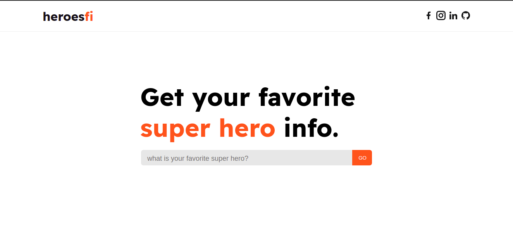
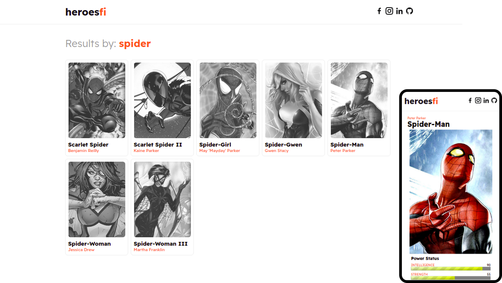

# Heroesfi

É uma aplicação Web/mobile (responsiva), construida com [ReactJS](https://pt-br.reactjs.org/) durante o Bootcamp Eduzz fullstack-developer2 na [Digital innovation one](https://web.dio.me/home).

Aplicação consiste em pesquisa de referência de Super Heróis, onde a mesma consome dados de uma api publica de heróis [superhero-api](https://akabab.github.io/superhero-api/api/).

## Telas

  

  

## Conceitos aplicados

- Componentização
- Reposividade
- Consumo de dados (api);
- Formatação de dados

## Clonando projeto

Com o git instalado, voce pode rodar:

### `git clone https://github.com/alemaocastro1986/heroes.git <nome-projeto>`

### `cd <nome-projeto>`

## Scripts disponíveis

No diretório do projeto, você pode rodar:

### `yarn start`

Executa o aplicativo no modo de desenvolvimento.\
Abra [http://localhost:3000](http://localhost:3000) para visualizar em seu navegador.

### `yarn build`

Compila o aplicativo para produção na pasta `build`.

## Autor

Andrius Cunha Castro

